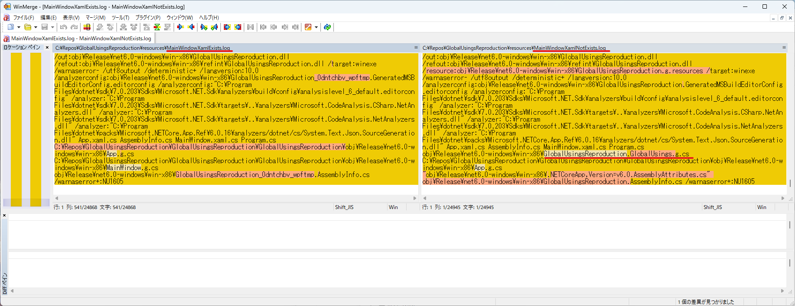

# Visual Studioから「発行」する場合、特定の条件下で「グローバル使用」が追加されない。

## 概要

Visual StudioのGUIから発行機能を利用した場合に、少なくとも次の条件で発行が失敗します。

1. WPFプロジェクト
2. MainWindow.xamlが含まれる（App.xamlは問題ない）
3. "global using"を自動追加するNuGetパッケージを参照している
4. 3のクラスを明示的にusingを指定せずに利用している
5. WPFプロジェクトでRuntimeIdentifierを指定しない
6. ターゲットランタイムを"ポータブル"以外を指定して発行する

上記のいずれか1つでも条件が異なれば、発行に成功します。

RuntimeIdentifierではなくRuntimeIdentifiersを指定しても失敗します。

## 直接原因

上記のすべての条件が満たされたとき、csc.exeにGlobalUsings.g.csが引数として渡されません。

resourcesフォルダの下にログを保管してあるので参照してください。

## 回避策

以下のいずれかで対応が回避は可能です。

1. コンソールから"dotnet publish"コマンドを利用して発行する
2. WPF側にRuntimeIdentifierを指定する
3. WPF側にRuntimeIdentifierまたはRuntimeIdentifiersを指定してMSBuildコマンドで発行する

win-x86とwin-x64の双方を発行したい場合、2は利用できず1または3を利用する必要があります。

MSBuildでは発行時にターゲットランタイムが指定されていた場合、RuntimeIdentifierもしくはRuntimeIdentifiersが.csprojで指定されていることが必須となっています。しかしVisual Studioでは存在チェックがなく、実行自体はできます。ここにも問題があるように感じます。

## 希望する対策

